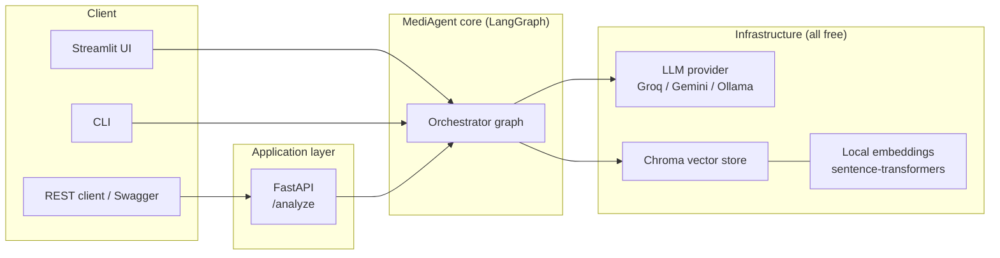
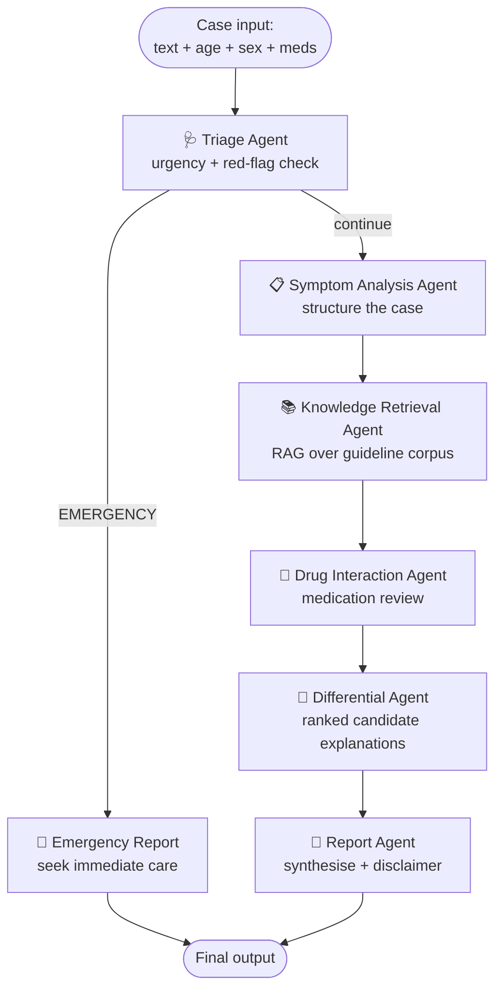

# Architecture

> Educational demonstration. Not a medical device. See the disclaimer in the README.

## 1. High-level system

## 2. Agent orchestration graph

## 3. Why this design

| Decision | Reason |
| --- | --- |
| **LangGraph** for orchestration | Explicit state + conditional edges; the emergency short-circuit is a real routing example, not a toy. In demand on AI-engineering job posts. |
| **Provider abstraction** (`llm.py`) | Swap Groq / Gemini / Ollama via one env var. Reviewers see clean dependency inversion; you stay on free tiers. |
| **RAG grounding** | Differential reasoning is anchored to a retrieved corpus instead of raw model memory, reducing hallucination. |
| **Local embeddings** | `sentence-transformers` runs free with no API key, so the RAG layer costs nothing. |
| **Safety module** | Deterministic red-flag detection + disclaimers everywhere. Signals you understand responsible AI in a regulated domain — a hiring differentiator. |
| **Three interfaces** (UI, API, CLI) | Same core, three entry points — demonstrates separation of concerns. |

## 4. Data flow (single request)

1. Client sends case → orchestrator initialises `ClinicalState`.
2. **Triage** runs first; red-flag terms or an EMERGENCY classification route straight to the emergency report (safety guardrail).
3. Otherwise the case flows through symptom structuring → RAG retrieval → drug review → differential reasoning.
4. **Report** agent synthesises all prior outputs and appends the mandatory disclaimer.
5. Final `ClinicalState` returned to the client.
